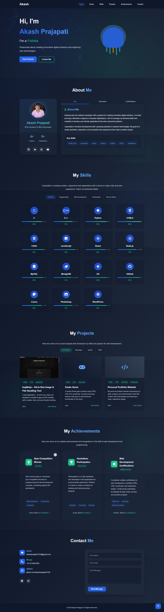

# Akash Prajapati - Personal Portfolio

A modern, responsive personal portfolio website built with HTML, CSS, and vanilla JavaScript. This portfolio features a sleek monochrome design with interactive elements and animations, showcasing my skills, projects, and achievements.



## 🌟 Features

- **Responsive Design**: Fully responsive layout that works on all devices (desktop, tablet, mobile)
- **SEO Optimized**: Fully optimized for search engines with sitemap.xml, robots.txt, Open Graph tags, Twitter Cards, and JSON-LD structured data
- **Performance Optimized**: Lazy loading images, deferred JavaScript, and resource hints for fast page load
- **Monochrome Design**: Elegant black and white color scheme for a professional look
- **Interactive Jellyfish Animation**: Animated jellyfish in the hero section that reacts to mouse movement
- **Particle Background**: Dynamic particle background that responds to user interaction
- **Smooth Scrolling**: Smooth scroll navigation between sections for better user experience
- **Card Hover Effects**: Interactive tilt effect on cards when hovered using VanillaTilt.js
- **Glassmorphism**: Modern glass-like UI elements for a contemporary feel
- **Tab-based Content**: Organized content in tabs for better information architecture
- **Filterable Projects**: Projects that can be filtered by category (Web Apps, Games, Other)
- **Skills Categorization**: Skills organized by category with visual progress indicators
- **Certificate Gallery**: Interactive gallery to view and download certificates
- **Lightbox Image Viewer**: Lightbox for viewing project images and certificates with navigation
- **Download Functionality**: Option to download certificates with success notification
- **Contact Form**: Simple contact form with validation for user inquiries
- **Responsive Navigation**: Hamburger menu for mobile devices

## 🛠️ Technologies Used

- **HTML5**: Semantic HTML structure for better accessibility and SEO
- **CSS3**: Modern CSS with flexbox and grid layouts, CSS variables, and animations
- **JavaScript**: Vanilla JavaScript for interactivity and dynamic content
- **Particles.js**: For the animated background particles effect
- **LottieFiles**: For the interactive jellyfish animation in the hero section
- **VanillaTilt.js**: For the 3D tilt effect on cards and achievement elements
- **Font Awesome**: For icons throughout the website
- **CSS Custom Properties**: For consistent theming and easy customization
- **CSS Grid & Flexbox**: For responsive layouts across all sections
- **CSS Animations**: For smooth transitions and interactive elements

## 📋 Sections

1. **Hero Section**: Introduction with animated jellyfish background and typewriter effect for displaying different roles
2. **About Me**: Personal information with tabbed sections for Bio, Education, and Certifications
   - **Bio**: Overview of skills and professional interests
   - **Education**: Timeline of educational background
   - **Certifications**: Overview of certifications with option to view all certificates in a gallery
3. **Skills**: Technical skills organized by category (Programming, Web Development, Frameworks, Tools)
   - Filterable by category with visual progress indicators
   - Interactive card design with hover effects
4. **Projects**: Showcase of personal projects with filtering options
   - **ImgNinja**: All-in-One Image & File Handling Tool
   - **Snake Game**: Classic snake game with modern interface
   - Project cards with links to GitHub repositories and live demos
5. **Achievements**: Notable accomplishments and awards with interactive cards
6. **Contact**: Contact information and form for inquiries

## 🚀 Getting Started

### Prerequisites

- A modern web browser (Chrome, Firefox, Safari, Edge)
- Basic knowledge of HTML, CSS, and JavaScript (for customization)

### Installation

1. Clone the repository:
   ```bash
   git clone https://github.com/akashprajapati1232/my-portfolio.git
   ```

2. Navigate to the project directory:
   ```bash
   cd my-portfolio
   ```

3. Open the project:
   - For local development, you can use a simple HTTP server:
     ```bash
     # If you have Python installed
     python -m http.server 8000

     # If you have Node.js installed
     npx serve
     ```
   - Or simply open the `index.html` file in your browser

## 📂 Project Structure

```
my-portfolio/
├── assets/
│   ├── animations/       # Animation JSON files
│   │   └── jellyfish.json
│   └── images/
│       ├── certificate/  # Certificate images
│       ├── ImgNinja/     # Project screenshots
│       └── snake-game/   # Game screenshots
├── css/
│   ├── animations.css    # Animation styles
│   ├── certificate-gallery.css # Certificate gallery styles
│   ├── lightbox.css      # Lightbox styles
│   ├── responsive.css    # Responsive design styles
│   ├── skills-projects.css # Skills and projects styles
│   └── style.css         # Main stylesheet
├── js/
│   ├── animations.js     # Animation scripts
│   ├── certificate-gallery.js # Certificate gallery functionality
│   ├── lightbox.js       # Lightbox functionality
│   ├── main.js           # Main JavaScript file
│   ├── skills-projects.js # Skills and projects functionality
│   ├── tabs.js           # Tab functionality
│   ├── tilt.js           # Card tilt effect
│   └── typing.js         # Typing animation
├── index.html            # Main HTML file
├── sitemap.xml           # XML sitemap for SEO
├── robots.txt            # Robots.txt for search engines
└── README.md             # This file
```

### Customization

1. **Personal Information**:
   - Update your name, tagline, and description in the `index.html` file
   - Replace placeholder text in the About section with your own information
   - Update profile image at `assets/images/akash-prajapati.jpg`

2. **Projects**:
   - Add your own projects by duplicating the project card structure in the Projects section
   - Update project titles, descriptions, and links
   - Add project screenshots to the appropriate folders in `assets/images/`

3. **Skills**:
   - Modify the skills listed to match your own expertise in the `index.html` file
   - Adjust skill percentages to reflect your proficiency level
   - Add or remove skill categories as needed

4. **Certificates**:
   - Add your certificates to the `assets/images/certificate/` folder
   - Update the certificate list in `js/certificate-gallery.js`

5. **Contact Information**:
   - Update the contact details with your own email, phone, and social media links in the `index.html` file

6. **Styling**:
   - Customize colors in the `css/style.css` file by modifying the CSS variables in the `:root` selector
   - Adjust animations in the `css/animations.css` file

## 📱 Responsive Design

The portfolio is designed to be fully responsive across all devices:

- **Desktop** (1200px and above): Full layout with all features and animations
- **Tablet** (768px to 1199px): Adjusted layout with preserved functionality and optimized spacing
- **Mobile** (below 768px): Streamlined layout with hamburger menu for navigation and stacked elements

## ✨ Animation Details

### Jellyfish Animation

The jellyfish animation in the hero section is created using LottieFiles. It reacts to mouse movement, creating an interactive experience. The animation is responsive and adapts to different screen sizes. If the LottieFiles script fails to load, a fallback CSS animation is provided.

### Particle Background

The background particles are created using Particles.js. They respond to mouse movement and clicks, adding an interactive layer to the website. The particle density and behavior are optimized for different devices to ensure smooth performance.

### Card Tilt Effect

The cards throughout the website use VanillaTilt.js to create a 3D tilt effect when hovered. This adds depth and interactivity to the UI. The tilt effect is applied to project cards, skill cards, and achievement cards.

### Typing Animation

The hero section features a typing animation that cycles through different roles (Web Developer, Software Developer, etc.). This is implemented using a custom JavaScript function that simulates typing and deleting text.

### Certificate Gallery

The certificate gallery provides an interactive way to view and download certificates:
- Grid layout for easy browsing of all certificates
- Lightbox view for detailed examination
- Navigation controls (previous/next) for browsing through certificates
- Download functionality with success notification
- Keyboard navigation support (arrow keys, Escape)
- Responsive design for all devices

## 🔧 Browser Compatibility

The portfolio is tested and works on the following browsers:

- Chrome (latest)
- Firefox (latest)
- Safari (latest)
- Edge (latest)
- Opera (latest)

## 🔄 Recent Updates

### December 2025 - SEO & Performance Optimization
- **SEO Enhancement**: Fully optimized for Google indexing with comprehensive meta tags
- **Sitemap.xml**: Created XML sitemap for better search engine crawling
- **Robots.txt**: Added robots.txt file to guide search engine crawlers
- **Open Graph Tags**: Implemented Facebook/LinkedIn social media preview tags
- **Twitter Cards**: Added Twitter Card meta tags for beautiful Twitter sharing
- **JSON-LD Structured Data**: Implemented Schema.org Person markup for rich search results
- **Lazy Loading**: Added lazy loading to all project images for 30-50% faster initial page load
- **Performance Optimization**: Optimized JavaScript loading with defer attributes
- **Resource Hints**: Added preconnect and dns-prefetch for external CDNs
- **Enhanced Alt Tags**: Improved image alt attributes for better SEO and accessibility
- **Canonical URLs**: Added canonical URL to prevent duplicate content issues
- **Theme Color**: Added theme-color meta tag for mobile browsers

### Previous Updates
- **Certificate Gallery**: Added a gallery to view and download certificates
- **Navigation Improvements**: Enhanced keyboard navigation throughout the site
- **Download Functionality**: Added ability to download certificates with success notifications
- **Performance Optimizations**: Improved loading times and animations
- **Accessibility Enhancements**: Improved keyboard navigation and screen reader support

## 📄 License

This project is licensed under the MIT License - see the [LICENSE](LICENSE) file for details.

## 🙏 Acknowledgments

- [Font Awesome](https://fontawesome.com/) for the icons
- [Particles.js](https://vincentgarreau.com/particles.js/) for the background animation
- [LottieFiles](https://lottiefiles.com/) for the jellyfish animation
- [VanillaTilt.js](https://micku7zu.github.io/vanilla-tilt.js/) for the tilt effect

## 📞 Contact

Akash Prajapati - [akashprajapati1232@gmail.com](mailto:akashprajapati1232@gmail.com)

- GitHub: [https://github.com/akashprajapati1232](https://github.com/akashprajapati1232)
- LinkedIn: [https://www.linkedin.com/in/akash-prajapati1232/](https://www.linkedin.com/in/akash-prajapati1232/)
- Instagram: [https://www.instagram.com/itz_prabhas43/](https://www.instagram.com/itz_prabhas43/)

Project Link: [https://github.com/akashprajapati1232/my-portfolio](https://github.com/akashprajapati1232/my-portfolio)

---

Made with ❤️ by Akash Prajapati
